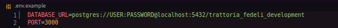
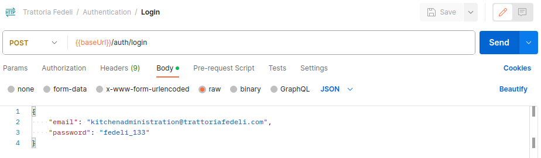
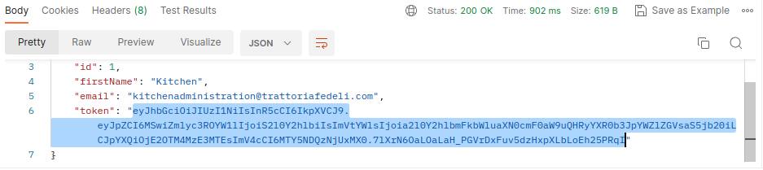
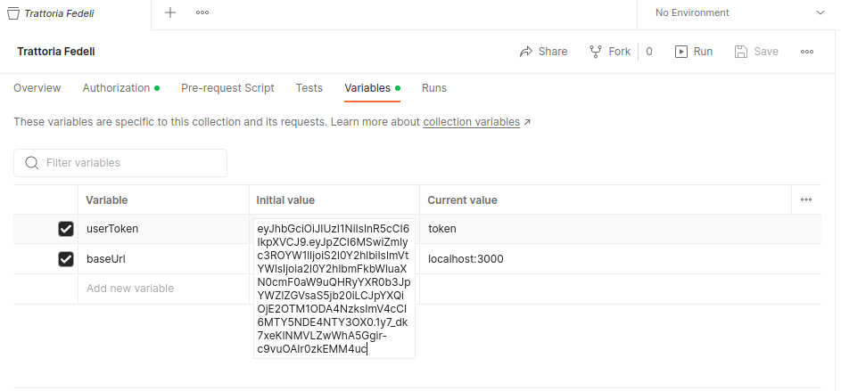

# Trattoria Fedeli - Back-end


## 📖 Index
- [About](#about-it)
- [Features](#features)
- [How to Use](#how-to-use)
- [Used Techs/Services](#techs-used)

## About The Project <a name = "about-it"></a>
This application contains the back-end and database containing for the Trattoria Fedeli Project. Its goal is to create a system that links itself to the front-end application to receive restaurant orders remotely from both the place's tables and deliveries.


## Project Features <a name = "features"></a>
- Product Registering;
- Category Creation;
- Product Management;
- User Authentication;
- General administration features.

## How to use <a name = "how-to-use"></a>
* SubIndex
- [Normal Installation](#normal-install)
- [Docker Installation](#docker-install)
- [User Panel](#user-panel)
- [Testing the API](#api-testing)


First, we need to set the API's environment variables. Browse to ```.env.example```, and rename it to ```.env```.
After that, we need to set the environment's configurations. At the URL's example, rename the 'USER' and 'PASSWORD' fields with your Postgres' credentials.


Now, for the mounting of the API, go to the ```.api.json``` file on the root directory, and paste all its content on your API Management Tool. It works properly on Postman.
After that, we're ready to launch the database and its API.

* Normal Installation <a name = "normal-install"></a>
After doing that, we need to install the application's dependencies. Run:

```$ npm install (or npm install --force, if any problem is shown.)```

With the files ready, we can now go to the database's creation. Fortunately, we have a script for the database creation, migration and seeding.

Run:

```$ npm run create```
After launching the command, the database will be fully fulfilled, and will become available to be used and tested. After that, we only will need to run ```$ npm run dev```if we want to run it.

* Docker Installation <a name = "docker-install"></a>
If you're using Docker, we have one more step to follow before launching the database. We need to change some stuff in the ```docker-compose.example.yml``` file. We only need to change the environment variable 'DATABASE_URL' with the value we inserted on the ```.env``` file. After doing that, rename the example file to ```docker-compose.yml```, and run the Docker commands:

```docker-compose build```
```docker-compose up```
After that, our application will be built, and the container is ready for usage.

* Accessing the panel <a name = "user-panel"></a>
After doing that, we now need to go to the administration panel.
Go to:
```localhost:3000/admin```

We will have a login page. The user's credentials are:
```
Email: kitchenadministration@trattoriafedeli.com
Password: fedeli_133
```
After that, we have full access to the administration section.

* Testing the API <a name = "api-testing"></a>
After pasting the API's information on your app, we need to run one of its routes before trying others. Run the database, so we can follow this process.
Head to 'Authentication > Login', and send the request:


After that, we will receive a response containing a token. We need this token in order to run the other requests.


Copy the token, and then go to the API's main window, and follow to the 'Variables' section.
After that, change the 'userToken' variable with the one you just received from the 'Login' request, pasting it:


After doing that, we're finally done, and able to use the application for tests and increments.

## ⛏ Used Techs/Services <a name = "techs-used"></a>
- [AdminJS](https://www.npmjs.com/package/adminjs)
- [BCrypt](https://www.npmjs.com/package/bcrypt)
- [CORS](https://www.npmjs.com/package/cors)
- [Docker](https://www.docker.com/)
- [Docker Compose](https://docs.docker.com/compose/gettingstarted/)
- [DotEnv](https://www.npmjs.com/package/dotenv)
- [Env-Var](https://www.npmjs.com/package/env-var)
- [Express](https://www.npmjs.com/package/express)
- [JWT](https://www.npmjs.com/package/jwt)
- [NodeJS](https://nodejs.org/)
- [Node-Postgres](https://www.npmjs.com/package/pg)
- [Photoshop](https://www.adobe.com/br/)
- [Prettier](https://www.npmjs.com/package/prettier)
- [Sequelize](https://www.npmjs.com/package/sequelize)
- [Sequelize-Cli](https://www.npmjs.com/package/sequelize-cli)
- [TS-Node-Dev](https://www.npmjs.com/package/ts-node-dev)
- [TypeScript](https://www.npmjs.com/package/typescript)